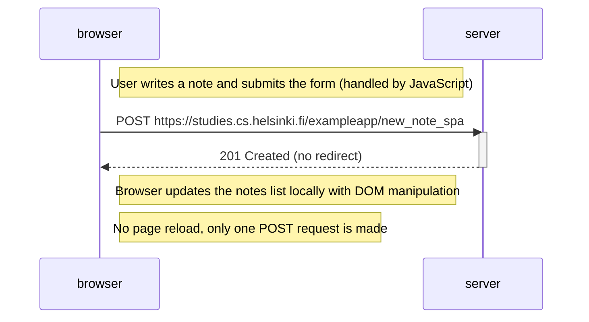

## User creates a new note in a Single Page App

```mermaid
sequenceDiagram
    participant browser
    participant server

    Note right of browser: User writes a note and submits the form (handled by JavaScript)

    browser->>server: POST https://studies.cs.helsinki.fi/exampleapp/new_note_spa
    activate server
    server-->>browser: 201 Created (no redirect)
    deactivate server

    Note right of browser: Browser updates the notes list locally with DOM manipulation
    Note right of browser: No page reload, only one POST request is made
```
